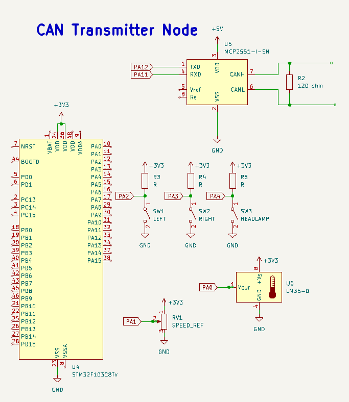
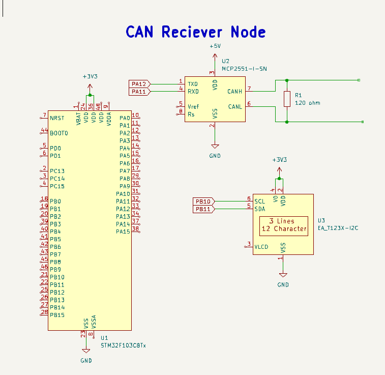

# ⭐ CAN-Based Body Control Module

##  💠Project overview
One STM32 acts as a Body Control Node, which collects multiple vehicle parameters such as indicator status, speed, and temperature, packages them into a CAN frame, and transmits the data over a 500 kbps CAN bus.
using the CAN Transceiver MCP2551

The second STM32 acts as an Instrument Cluster  which receives CAN messages, decodes the data, displays parameters on an LCD, and controls outputs such as left indicator, right indicator, and headlamp.
##  💠System Architecture
```
  +----------------------------+        CAN Bus (500 kbps)        +----------------------------+
|  Body Control Node (BCM)   | <-----------------------------> | Instrument Cluster Node    |
|  STM32F103C8T6             |                                 | STM32F103C8T6              |
|                            |                                 |                            |
| - Speed input (ADC)        |                                 | - LCD Display              |
| - Temperature input (ADC)  |                                 | - Left Indicator Output    |
| - Indicator & Lamp Switch  |                                 | - Right Indicator Output   |
| - CAN Transmitter          |                                 | - Headlamp Output          |
+----------------------------+                                 +----------------------------+
```
## 💠CAN Schematic



## 💠CAN Communication Details
- Protocol: CAN 2.0A (Standard Identifier)
- Bitrate: 500 kbps
- CAN Peripheral: STM32F103 bxCAN
- CAN Transceiver: MCP2551
- CAN Mode: Normal mode
- CAN Identifier Used: 0x100
- Filter Mode: Mask mode
- Filter Scale: 32-bit
- FIFO Used: FIFO0
- Termination:Two  120 Ω resistors placed at both physical ends of the CAN bus


## 💠CAN Data Frame Format

| Byte | Data          |
|------|---------------|
| 0    | Speed         |
| 1    | Switch Status |
| 2    | Temperature   |

- Byte 1 => Bit 0 - left indicator , Bit 1 - right indicator , Bit 2 -Headlamp


 
  

